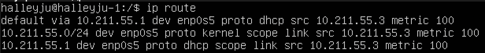
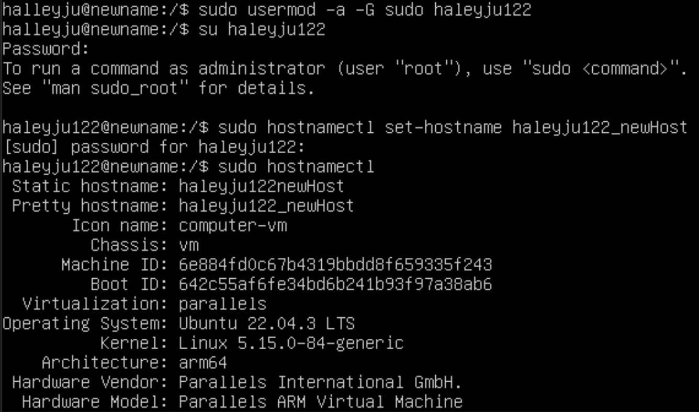
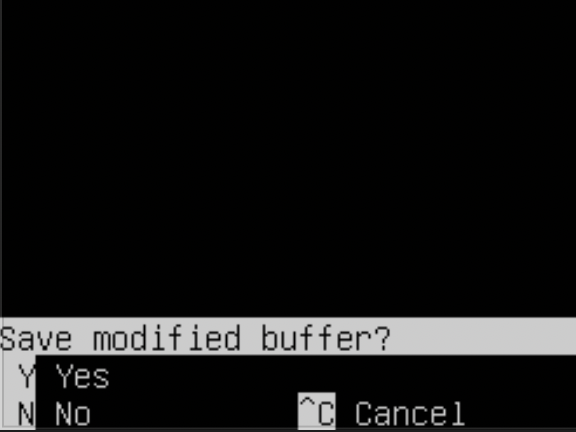

# 1. Установка OC
>cat /etc/issue

P.S: У меня мак на М1, сюда можно поставить только 22.04.

# 2. Создание нового пользователя
>• sudo adduser halleyju122

>• sudo usermod -g adm halleyju122

>• cat etc/passwd | grep user

# 3. Настройка сети ОС
>• sudo hostnamctl set-hostname user-1

#### Устанавливаем временную зону
>• sudo timedatectl set-timezone Europe/Samara

 
#### Сетевые адреса 

На системах Unix интерфейс loopback обычно имеет имя lo.
Интерфейс loopback имеет несколько путей применения. Он может быть использован сетевым клиентским программным обеспечением, чтобы общаться с серверным приложением, расположенным на том же компьютере.

Dynamic Host Configuration Protocol (DHCP) — автоматический предоставляет IP адреса и прочие настройки сети (маску сети, шлюз и т.п) компьютерам и различным устройствам в сети.

> Внешний IP-адрес шлюза

 

> Внутренний IP-адрес шлюза

>• cd etc/netplan

>• sudo nano 00-installer-config.yaml

>• sudo netplan generate

>• sudo netplan apply

>• reboot

# 4. Обновление ОС
>• sudo apt update

# 5. Использование команды sudo

Sudo — это утилита, предоставляющая привилегии root для выполнения административных операций в соответствии со своими настройками. Она позволяет легко контролировать доступ к важным приложениям в системе.
>• sudo usermodd -a -G sudo new_user

>• sudo hostnamectl set-hostname new_hostname

# 6. Установка и настройка службы времени
>• sudo timedatectl

>• timedatectl show

# 7. Установка и использование текстовых редакторов

#### Скачиваем текстовые редакторы 
>• sudo apt install mcedit

>• sudo apt install nano

>• sudo apt install vim

##### VIM 

>:wq - выход с сохранением

##### NANO

>Cmd + x + y + enter  - сохранение и выход

##### MCEDIT

>Esc + 2 + 10 - сохранение и выход

##### VIM

>:!q - выход без сохранения

##### NANO

>Cmd + n - выход без сохранения

##### MCEDIT

>Esc + 10 + NO - выход без сохранения

##### VIM

>Esc + : s /find word/to do - найти и заменить

##### NANO

>Cmd + w - найти, cmd + \ - заменить

##### MCEDIT

>Esc + 7 - найти, esc + 4 - заменить

# 8. Установка и базовая настройка сервиса SSHD

>• sudo apt-get install ssh

>• sudo apt install openssh-server

>• ssh-status

>• sudo nano /etc/ssh/sshd_config

•	ps (показывает запущенные процессы, выполняемые пользователем в окне терминала);

•	ps -e или ps -A (Чтобы просмотреть все запущенные процессы);

•	ps -d (Чтобы показать все процессы, кроме лидеров сессии);

•	ps -d -N (можно инвертировать вывод с помощью переключателя -N. Например, если хочу вывести только лидеров сеансов);

•	ps T (увидеть только процессы, связанные с этим терминалом);

•	ps r (просмотреть все работающие (running) процессы);

NETSTAT

>netstat -tan

•	-t (--tcp) отображает соедниеня только по tcp;

•	-a (--all) вывод всех активных подключений TCP;

•	-n (--numeric) вывод активных подключений TCP с отображением адресов и номеров портов в числовом формате;

•	Proto: Название протокола (протокол TCP или протокол UDP);

•	recv-Q: очередь получения сети;

•	send-Q: Сетевая очередь отправки;

•	Local Address адрес локального компьтера и используемы номер порта;

•	Foreign Address адрес и номер удаленного компьтера к которомц подключен сокет;

•	State состояние сокетв;

•	0.0.0.0 означает IP-адрес на локальной машине;

# 9. Установка и использование утилит top, htop
#### TOP
•	uptime - 15min;

•	количество авторизованных пользователей - 1;

•	общую загрузку системы - 0.00, 0.01, 0.00;

•	общее количество процессов - 106;

•	загрузку cpu - 0.0%;

•	загрузку памяти - 163/1967;

•	pid процесса занимающего больше всего памяти - 1029(top -o %MEM);

•	pid процесса, занимающего больше всего процессорного времени - 1029 (top -o %CPU);

#### HTOP
>PID

>CPU

>MEM 

>TIME

>SSHD

>SYSLOG

>+hostname, clock, uptime

# 10. Использование утилиты fdisk

>fdisk -I

•   Название жесткого диска Ubuntu 22.04 Sch;

•   Размер 64 GB;

•   Количество секторов 134217728;

•   Размер swap 2 GB;

# 11. Использование утилиты df

>df 

•	размер раздела - 31270768;

•	размер занятого пространства - 5176368;

•	размер свободного пространства - 24480372;

•	процент использования - 18-%;

>df -Th

•	размер раздела - 30G;

•	размер занятого пространства - 5.0G;

•	размер свободного пространства - 24G;

•	процент использования - 18%

# 12. Использование утилиты du
>• sudo du -sh /home /var/log /var

В байтах

>• sudo du -s --block-size=1 /home /var/log /var

В человекочитаемом виде

>• sudo du var/log/*

# 13. Установка и использование утилиты ncdu

>• sudo apt-get install ncdu

>• ncdu home

>• ncdu var 

>• ncdu var/log

# 14. Работа с системными журналами

>• sudo nano var/log/dmesg

>• sudo nano var/log/syslog

>• sudo nano var/log/auth.log

Last login

SSHD restart
>• sudo systemctl restart ssh

>• grep "ssh" /var/log/syslog

# 15. Использование планировщика заданий CRON

>uptime

